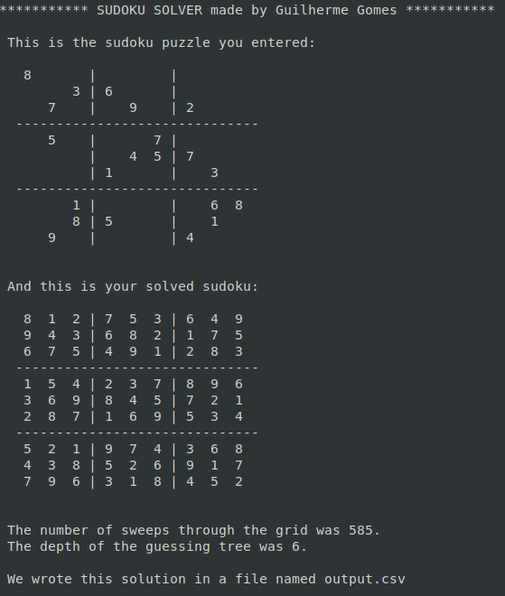

# sudoku-solver
Simple sudoku solver made in C++.

### Screenshot
This is how it looks like in the terminal.

### Compilation
With GCC installed, just run the makefile by executing `make`. To clean the object and executable file, run `make clean`.

### Input
The input is made by creating a csv file with the sudoku unsolved grid. You can checkout some [input examples](/input-examples).

### Execution
The executable file generated by the makefile is called sudoku-solver, if you used the makefile to compile, use the following command to execute `./sudoku-solver /input/location/file.csv`
